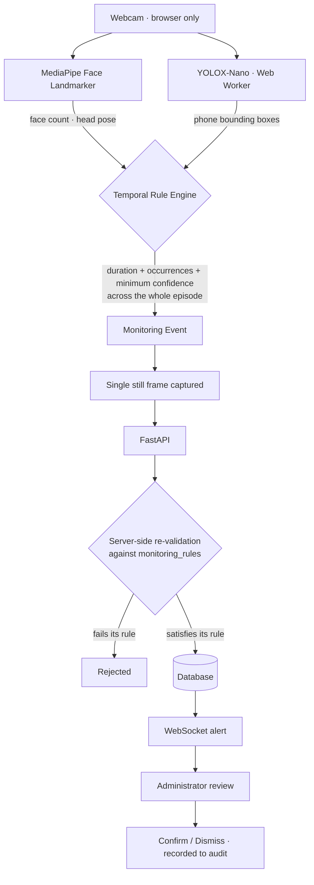
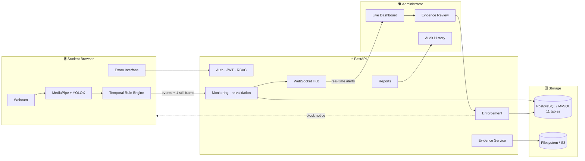

<div align="center">

# Exam Nigahban

### AI-Assisted Examination Monitoring and Evidence Management System

*Nigahban* (نگہبان) — Urdu for **guardian**, *the one who keeps watch*.

**For universities, educational institutions, and testing organizations.**

[](https://exam-nigahban.vercel.app)
[](https://exam-nigahban-api.onrender.com/health)
[]()
[]()

**[Live System](https://exam-nigahban.vercel.app) · [API Docs](https://exam-nigahban-api.onrender.com/docs) · [Health](https://exam-nigahban-api.onrender.com/health)**

</div>

---

## About

Exam Nigahban is an AI-assisted examination monitoring and evidence
management system designed for universities, educational institutions, and
testing organizations. It strengthens examination integrity by identifying
**predefined monitoring events** during controlled examinations, including
mobile-phone presence, face absence, multiple faces, unusual head movement,
and looking away.

Detection results are evaluated using **confidence, duration, occurrence,
and temporal rules** to reduce false and repeated alerts. When a monitoring
event meets the configured criteria, the system generates a **structured
record** containing the event type, timestamp, detection details, and
supporting evidence. Authorized administrators can then review these events
and evidence, make the final decision, and record the outcome through an
**auditable workflow**.

---

## The problem, and the position this system takes

Remote and large-scale examinations created a supervision gap, and much of
what filled it went too far: continuous video recording, opaque risk scores,
and software that tells an institution a student cheated.

Exam Nigahban takes the opposite position. It watches for a small, declared
set of **observable conditions** — a face that leaves the frame, a second
face, a sustained head turn, a phone in view — and when one persists long
enough to matter, it captures a single still frame and puts it in front of a
human being.

> ### The system never decides that a student cheated.
>
> It detects conditions, generates evidence, and alerts an administrator.
> Every determination of misconduct is made by a named person, recorded
> against their name, at a recorded moment. The word *cheating* appears
> nowhere in the interface — and a test suite enforces that.

Three consequences follow from that position, and they shape the entire
architecture:

| Principle | How it is enforced |
|---|---|
| **Video never leaves the browser** | All inference runs client-side. The server receives events and one still image, never a stream. |
| **The AI proposes, a human disposes** | No event can reach a disciplinary outcome without an administrator confirming it first. |
| **Every decision is attributable** | The audit trail is append-only. A reversal is a new row, never an edit. |

---

## What it does

<table>
<tr><td width="33%" valign="top">

### 🎓 For students

Sign in, accept terms, pass a camera readiness check, and sit the exam.
A live status panel shows exactly what is being monitored — no hidden
watching. Answers persist as you go; the timer is enforced server-side,
so a closed laptop does not buy extra minutes.

</td><td width="33%" valign="top">

### 🛡️ For administrators

A live dashboard with a notification bell that fills as alerts arrive over
WebSocket. Open an alert, see the captured frame beside the rule that
fired, and decide: **Confirm** or **Dismiss**. Escalate proportionately
when warranted. Generate a case report.

</td><td width="33%" valign="top">

### ⚙️ For the institution

Reports per student, per session, per program and per section — printable,
and exportable to CSV. A complete audit history. A protected system
administrator account that no one, including itself, can delete or
deactivate.

</td></tr>
</table>

---

## How monitoring actually works

The interesting engineering is not the detection — it is everything built
to stop the detection from being believed too easily.



### Three gates, not one

A single suspicious frame proves nothing — lighting flickers, a hand passes
over the camera, someone glances at the door. So a detection must survive
three independent filters before an administrator ever sees it:

1. **Per-frame confidence** — the detector's own threshold, applied at decode time.
2. **Temporal persistence** — the rule engine tracks the *minimum* confidence
   observed across the entire episode, not the peak. One strong frame in a
   weak sequence cannot carry an event through.
3. **Server-side re-validation** — the backend independently re-checks every
   incoming event against the `monitoring_rules` table. **An event that does
   not satisfy its configured rule is rejected.** The API cannot be used to
   inject fabricated events, even with a valid student token.

### Baseline rules

Stored in the database, configurable at runtime, mirrored in
`frontend/src/monitoring/constants.js`.

| Activity | Min. duration | Occurrences | Confidence | Severity |
|---|:---:|:---:|:---:|:---:|
| `HEAD_LEFT` | 3 s | ×3 | ≥ 0.75 | Medium |
| `HEAD_RIGHT` | 3 s | ×3 | ≥ 0.75 | Medium |
| `HEAD_UP` | 3 s | ×3 | ≥ 0.75 | Medium |
| `HEAD_DOWN` | 3 s | ×3 | ≥ 0.75 | Medium |
| `LOOKING_AWAY` | 3 s | ×3 | ≥ 0.75 | Medium |
| `FACE_ABSENT` | 3 s | ×1 | ≥ 0.50 | **High** |
| `MULTIPLE_FACES` | 2 s | ×1 | ≥ 0.50 | **High** |
| `MOBILE_PHONE` | 0.5 s | ×1 | ≥ 0.40 | **High** |

**Why phone detection is tuned differently.** The confidence bar sits at
0.40 rather than 0.80 deliberately. Because the engine compares against the
*minimum* confidence across an episode, a high bar meant one motion-blurred
frame discarded an otherwise solid sighting. Persistence does the filtering
instead: at a 200 ms detection cadence, 0.5 s requires **four consecutive
detections** — a real sighting, not a flicker. The frame is letterboxed
rather than cropped, so a phone is caught anywhere in view, including
partially out of frame.

---

## Evidence and enforcement

**Evidence** is one downsized still frame, captured only when a rule fires —
never on a timer, never continuously. Storage is abstracted behind a single
module with local-filesystem and S3-compatible backends (Cloudflare R2, AWS
S3, MinIO). Capture is strictly best-effort: a storage failure can never
cause the monitoring event itself to be lost.

**Enforcement** is a proportionate ladder, reachable only *after* a human has
confirmed the evidence:

```
BLOCK  ──────────►  CANCEL_EXAM  ──────────►  UFM_CASE
timed pause,        session voided,           formal Unfair Means
liftable            score 0, terminal         case, terminal
```

Blocks are enforced server-side on **every** student write path — not in the
interface — and reach the candidate in real time over a dedicated session
channel.

**Voiding, not deleting.** The system administrator can void an event or an
exam with a stated reason and a password re-confirmation. Voided rows become
tombstones: excluded from every list and report, still present for the audit
trail, and refused outright if an active enforcement action depends on them.
Nothing in this system is ever truly deleted.

---

## Technology

<table>
<tr><th align="left">Frontend</th><td>

React 19 · Vite 8 · Bootstrap 5.3 · React Router 7 · Axios · native WebSocket API · MediaDevices / `getUserMedia()`

</td></tr>
<tr><th align="left">Computer vision</th><td>

MediaPipe Face Landmarker (face presence, count, head pose) · YOLOX-Nano ONNX via `onnxruntime-web`, running in a **Web Worker** so inference never blocks the exam UI

</td></tr>
<tr><th align="left">Backend</th><td>

Python 3.12 · FastAPI · SQLAlchemy · Pydantic v2 · PyJWT · passlib/bcrypt · boto3 · Uvicorn / Gunicorn

</td></tr>
<tr><th align="left">Data</th><td>

MySQL (development) · PostgreSQL (production) — migrations are dialect-portable, compiling column types from the models themselves

</td></tr>
<tr><th align="left">Quality</th><td>

pytest · Vitest · oxlint · structured JSON logging · an external deployment verifier (`check_deployment.py`)

</td></tr>
<tr><th align="left">Deployment</th><td>

Vercel (frontend) · Render (API, Blueprint-defined) · Neon (PostgreSQL)

</td></tr>
</table>

**Deliberately absent:** Redis, Tailwind, Redux, Next.js, jQuery, message
queues, microservices, Kubernetes. None was needed, and each would have made
the system harder for a small team to maintain and for a judge to read.

---

## Architecture



**Scale of the implementation**

| | |
|---|---|
| HTTP endpoints | **51**, plus 2 authenticated WebSocket channels |
| Database tables | **11** |
| Backend tests | **448** passing |
| Frontend tests | **268** passing |
| Admin screens | 12 |
| Student screens | 7 |

### Database

`users` · `students` · `exams` · `questions` · `exam_sessions` ·
`student_answers` · `monitoring_rules` · `monitoring_events` · `evidence` ·
`admin_actions` · `enforcement_actions`

```
User ──┬── Student ── ExamSession ──┬── StudentAnswer
       └── Administrator            ├── MonitoringEvent ──┬── Evidence
                                    │                     └── AdminAction
Exam ──┬── Question                 └── EnforcementAction
       └── ExamSession
```

---

## Security

- **No self-registration.** Only an administrator creates accounts — student or admin.
- **Passwords** are bcrypt-hashed, never stored or logged in any recoverable form. A test suite asserts that no password, hash, or token ever reaches a log line.
- **JWT sessions** with role-based authorization on every route. Deactivating an account revokes access on the very next request.
- **A protected system administrator** that cannot be deleted, edited or deactivated — by any other administrator, or by itself. There is always exactly one account that cannot be locked out.
- **Step-up authentication** for destructive operations, with per-user lockout after 5 failed attempts. The lockout holds even against the correct password.
- **WebSockets are authenticated** on connect; the student channel carries nudges only, never state.
- **Evidence access** is restricted to authenticated administrators. Reports never expose an evidence file path.

---

## Getting started

**Prerequisites:** Python 3.12+, Node.js 20+, MySQL 8 (or PostgreSQL), Git, a Chromium-based browser.

### Backend

```bash
cd backend
python -m venv .venv
.venv\Scripts\activate          # Windows  ·  source .venv/bin/activate on macOS/Linux
pip install -r requirements.txt
```

Create `backend/.env` from the template — see `backend/.env.example` for the
annotated version:

```ini
APP_NAME=Exam Nigahban API
ENVIRONMENT=development

DB_HOST=localhost
DB_PORT=3306
DB_USER=root
DB_PASSWORD=your_database_password
DB_NAME=exam_nigahban

SECRET_KEY=generate_a_long_random_value
CORS_ORIGINS=http://localhost:5173

EVIDENCE_BACKEND=local
EVIDENCE_STORAGE_ROOT=evidence
```

> **Never commit the real `.env`.** For durable evidence storage on an
> ephemeral host such as Render, set `EVIDENCE_BACKEND=s3` with the bucket
> and credential variables, then run `backend/migrate_evidence_to_s3.py`
> once to move any legacy database-embedded images.

Create the database and start the API:

```bash
mysql -u root -p -e "CREATE DATABASE exam_nigahban;"
uvicorn app.main:app --reload
```

| | |
|---|---|
| API | http://127.0.0.1:8000 |
| Health | http://127.0.0.1:8000/health |
| Swagger | http://127.0.0.1:8000/docs |

### Frontend

```bash
cd frontend
npm install
npm run dev
```

Available at **http://localhost:5173**.

### Tests

```bash
cd backend && pytest -q          # 448 tests
cd frontend && npm test          # 268 tests
```

---

## Known limitations

Stated deliberately. A system that knows where its own boundary sits is
easier to trust than one that claims to have none.

**Monitoring runs in the student's browser, by design.** This is what keeps
webcam video off the network and makes the privacy guarantee real, but it
also means the server only learns what the client reports. The server
re-validates every incoming event against its configured rule, so fabricated
or under-threshold events are rejected — but it cannot detect events that are
*never sent*. A determined student who disables the monitoring script
produces no events and currently looks the same as one who behaved.

> *Planned mitigation:* a liveness heartbeat. The exam client would report
> periodically that its camera and detectors are running, and the dashboard
> would flag any active session that has gone quiet. This converts silence
> from invisible into visible without moving inference to the server.

**The camera requirement is enforced in the interface, not the API.** The
pre-exam readiness check gates the Begin Exam button on camera permission,
but the session-start endpoint does not independently verify it. The same
heartbeat above is the intended fix.

**Detection quality depends on conditions** — lighting, camera placement,
occlusion, and hardware. This is precisely why every event is treated as
*evidence requiring review* rather than as a finding, and why thresholds live
in the database rather than in the code.

**Deliberately out of scope for the MVP**, listed so their absence reads as a
decision rather than an oversight: request rate limiting, Alembic migration
tooling, a CI job exercising the production database engine, short-lived
ticket exchange for WebSocket authentication, and facial identity
verification. Each is understood; none is required to demonstrate the system.

---

## Scope

<table>
<tr><td valign="top" width="50%">

**✅ In scope**

Secure authentication · administrator-controlled accounts · student and admin
management · exam and question management · timed sessions · answer
persistence and scoring · camera readiness check · AI-assisted monitoring ·
head pose · face absence · multiple faces · phone detection · temporal rules ·
evidence capture and storage · real-time alerts · evidence review ·
proportionate enforcement · voiding with audit · reporting and CSV export ·
append-only audit history · structured logging · responsive UI

</td><td valign="top" width="50%">

**❌ Out of scope**

Autonomous determinations of misconduct · continuous video recording ·
smartwatch, camera, laptop or tablet detection · biometric identity
recognition · microservices · Kubernetes · Redis · distributed
infrastructure · a mobile application

</td></tr>
</table>

Additional features require explicit approval before implementation.

---

<div align="center">

**Exam Nigahban**
AI-Assisted Examination Monitoring and Evidence Management System

Built for the AI National / Alibaba Cloud AI Hackathon Pakistan 2026

---

**Detect · Evaluate · Evidence · Alert · Review · Decide**

*The machine watches. The human decides.*

Developed for educational, research and hackathon purposes.

</div>
